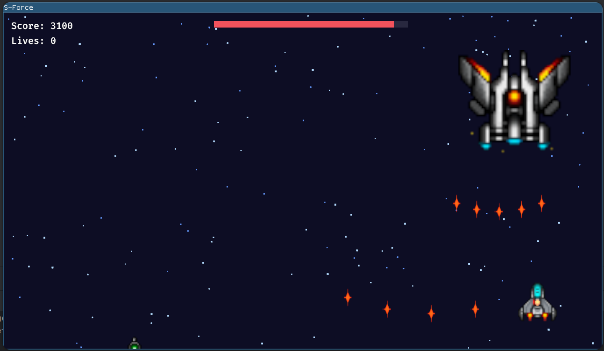

# S-Force

S-Force is a vertical space shooter built with Rust and Bevy 0.14. Pilot a nimble fighter, thin out escalating enemy waves, grab weapon upgrades, and survive long enough to topple a three-phase boss.



## Overview
- **Game loop** – Start on the title screen, tune difficulty or audio levels, then dive into an endless wave ladder. Clear waves to raise your score; the boss warps in once you cross 2,600 points. Beat it to roll back to the title screen and chase a higher score.
- **Presentation** – A parallax starfield, animated sprites, particle-style explosions, and synthesised audio cues keep the action lively without loading any external sound files.
- **State flow** – The game moves between Title → Playing → Paused → Game Over using Bevy states, keeping UI/HUD elements and systems scoped to the appropriate mode.

## Controls
| Action | Keys |
| --- | --- |
| Start / confirm | `Space`, `Enter`, or left click |
| Movement | `WASD` or Arrow keys |
| Fire | Hold `Space` or hold left mouse button |
| Pause / resume | `P` or `Esc` |
| Toggle debug overlay | `F3` |
| Title settings | `Tab` cycles difficulty · `-` / `+` change music volume · `[` / `]` change SFX volume |

## Gameplay Features
- **Enemy variety** – Grunts, sine-wave flyers, zig-zag strafers, tanky gunships, and aggressive chasers each carry unique health, hitboxes, and movement curves. Waves mix these archetypes and gradually tighten spawn intervals to ramp difficulty.
- **Boss encounter** – Once the score threshold is met, a capital ship enters the arena, locking wave spawns and cycling through entry, second, and final phases with distinct movement and bullet spreads. A HUD health bar tracks progress.
- **Player arsenals & boosts** – Weapon pickups unlock double shots, spread volleys (3- and 5-way), and dual lasers. Rapid-fire cores shorten cooldowns, shield cores extend short invulnerability, hull patches restore a full hit, and rare disruptors grant a 10-second invincibility window. The pilot flies with three lives, each worth five hull segments, and power-ups drop from specific enemies once per wave so you always know when backup is inbound.
- **HUD + meta systems** – Score and a segmented hull bar are shown on an in-game HUD, while pause/game-over overlays keep the action readable. A debug overlay (`F3`) displays FPS, entity count, and current wave for tuning.
- **Audio + effects** – Music, UI bleeps, shots, hits, explosions, and pickups are generated procedurally at startup, ensuring a tiny audio footprint. Explosions, bullets, and power-ups share a unified atlas to keep draw calls low.
- **Camera & background polish** – The camera maintains a fixed logical resolution (1280×720) and clamps gameplay to the viewable area. Background stars scroll at two speeds for depth.

## Running the Game
1. **Install Rust** (1.75+ recommended) via [rustup](https://rustup.rs/) if you do not already have it.
2. Fetch dependencies and run the game:
   ```bash
   cargo run --release
   ```
   Development builds (`cargo run`) work, but `--release` enables optimisations important for maintaining 120 Hz fixed updates.
3. On launch you land on the title screen. Adjust difficulty/audio as desired, press `Space`, and play.

> **Note:** Bevy will open a native window sized to 1280×720 and relies on a GPU/driver that supports Vulkan/Metal/DirectX 12 (or the fallback for your platform).

## Development Workflow
- Format code with `cargo fmt` and lint with `cargo clippy --all-targets -- -D warnings`.
- The game logic uses both `Update` and `FixedUpdate` schedules. When adding systems, ensure long-running logic runs in `FixedUpdate` if it needs deterministic movement.
- Assets hotload via Bevy's asset server, so when tweaking sprite sheets under `assets/images`, restart the game (or use `cargo watch -x run`) to reload the atlases.
- Useful commands (install [`cargo-watch`](https://github.com/watchexec/cargo-watch) for the first one):
  ```bash
  # Continuous run while editing
  cargo watch -x 'run --release'

  # Check for compilation errors quickly
  cargo check
  ```

## Project Layout
- `src/main.rs` – Configures the Bevy `App`, window, and attaches the gameplay plugin tree.
- `src/game/` – Contains feature-focused plugins (player, weapons, enemies, power-ups, UI, boss, audio, etc.). Each plugin owns its components, resources, and systems.
- `src/util/` – Reserved for future utility helpers (currently a placeholder module).
- `assets/` – Runtime assets (sprite sheets, screenshot, iconography). Bevy serves these directly from the working directory.

## Assets
- `assets/images/tinyShip*.png` supply the player/enemy/boss sprite sheets. Frames are sliced at startup into atlases; see `src/game/ship_sprites.rs`.
- `assets/images/explosions.png` hosts explosion, bullet, and power-up animations used by `EffectsPlugin` and `PowerupsPlugin`.
- `assets/screenshot.png` is the gameplay capture used above.
- Audio content is synthesised procedurally at runtime; no external `.wav` files are stored in the repo. All assets remain in-tree so the game can run without additional downloads.

## Enemy Storyboard
- `assets/storyboard.json` drives the endless-wave “storyboard”. Each level entry contains an ordered list of waves, and each wave declares:
  - `delay_seconds` – how long to wait after the previous wave before spawns begin (this duration is scaled by the selected difficulty’s spawn-factor at runtime).
  - `pattern` – either `lane` (spawn the same enemy across multiple `lanes`) or `fixed` (spawn a list of individually positioned enemies).
  - `movement` – a typed object (`straight`, `sine`, `zig_zag`, `tank`, or `chaser`) with optional tuning fields such as `speed`, `amplitude`, or `turn_rate`.
  - `powerup` – optional per-wave (lane) or per-entry (fixed) power-up drops; specify `powerup_lane_index` for lane formations to pick which ship carries the drop.
- Levels are played sequentially: once you’ve cleared at least one full cycle of the current level and toppled the boss, the director advances to the next entry (wrapping to the first after the last) and resets its pacing. Until then, waves loop so you can keep building score for the boss trigger.
- Edit the JSON while iterating to reorder enemies, tweak delays, or move power-ups without touching Rust code. The game loads this file on startup; restart after editing to apply changes.

## Troubleshooting & Tips
- If the window opens but remains black, ensure your graphics drivers are up to date and try running with `WGPU_BACKEND=vulkan`/`metal`/`dx12` set explicitly.
- Performance dips usually indicate debug/release mismatch. Double-check you are running `cargo run --release`.
- The `F3` overlay is handy when tuning spawn pacing or verifying that entity cleanup works after a game-over.

Happy shooting!
